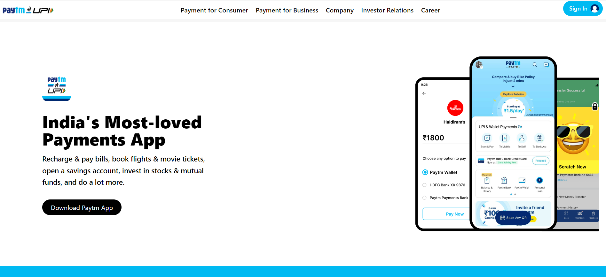

# Pratiksha Taank

***
## Technology Used
- HTML
- Tailwind CSS
## Screenshot

### Mobile Responsive

## What I have learn in this project
- How to use Tailwind classes
- How to make a website responsive using tailwind css
## Time Spent
I spent 10 hours to complete this project
## Live Link
Preview the project [Here](https://paytm-clone-twcss.netlify.app/)
